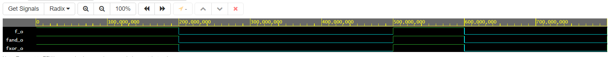
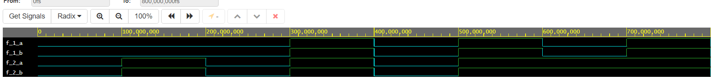

# De Morgan's Laws

## Table

c | b | a | f(c,b,a)
------------ | ------------- | ------------- | -------------
0 | 0 | 0 | 1
0 | 0 | 1 | 1
0 | 1 | 0 | 0
0 | 1 | 1 | 0
1 | 0 | 0 | 0
1 | 0 | 1 | 1
1 | 1 | 0 | 0
1 | 1 | 1 | 0

 
``` vhdl
library ieee;               -- Standard library
use ieee.std_logic_1164.all;-- Package for data types and logic operations

------------------------------------------------------------------------
-- Entity declaration for basic gates
------------------------------------------------------------------------
entity gates is
    port(
        a_i    : in  std_logic;         -- Data input
        b_i    : in  std_logic;         -- Data input
        c_i    : in  std_logic;
        f_o    : out std_logic;         -- OR output function
        fand_o : out std_logic;         -- AND output function
        fxor_o : out std_logic          -- XOR output function
    );
end entity gates;

------------------------------------------------------------------------
-- Architecture body for basic gates
------------------------------------------------------------------------
architecture dataflow of gates is
begin
    f_o  <= ((not b_i) and a_i) or ((not c_i) and (not b_i));
    fand_o <= not(not(not b_i and a_i) and not(not c_i and not b_i));
    fxor_o <= not(b_i or not a_i) or not(c_i or b_i);

end architecture dataflow;
```



[EDA playground link](https://www.edaplayground.com/x/8LxB)


# Distributive law


``` vhdl
------------------------------------------------------------------------
--
-- Example of basic OR, AND, XOR gates.
-- Nexys A7-50T, Vivado v2020.1, EDA Playground
--
-- Copyright (c) 2019-2020 Tomas Fryza
-- Dept. of Radio Electronics, Brno University of Technology, Czechia
-- This work is licensed under the terms of the MIT license.
--
------------------------------------------------------------------------

library ieee;               -- Standard library
use ieee.std_logic_1164.all;-- Package for data types and logic operations

------------------------------------------------------------------------
-- Entity declaration for basic gates
------------------------------------------------------------------------
entity gates is
    port(
        x_i    : in  std_logic;         -- Data input
        y_i    : in  std_logic;         -- Data input
        z_i    : in  std_logic;
        f_1_a  : out std_logic;         -- left side of the 1. equation
        f_1_b  : out std_logic;         -- right side of the 1. equation
        f_2_a  : out std_logic;         -- left side of the 2. equation
        f_2_b  : out std_logic			-- right side of the 2. equation
    );
end entity gates;

------------------------------------------------------------------------
-- Architecture body for basic gates
------------------------------------------------------------------------
architecture dataflow of gates is
begin
    f_1_a <= (x_i and y_i) or (x_i and z_i);
    f_1_b <= x_i and (y_i or z_i);
    f_2_a <= (x_i or y_i) and (x_i or z_i);
    f_2_b <= x_i or (y_i and z_i);

end architecture dataflow;
```


[EDA playground link](https://www.edaplayground.com/x/TCJ6)


