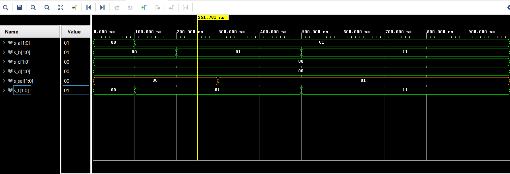

# Part 1 

| **Switches** | **Connections** | **Resistors (10kΩ)** |-| **Leds** | **Connections** | **Resistors (330Ω)** |
| :-: | :-: | :-: | :-: | :-: | :-: | :-: |
| SW0 | J15 | R35 |-| LED0 | H17 | R33 |
| SW1 | L16 | R37 |-| LED1 | K15 | R34 |
| SW2 | M13 | R38 |-| LED2 | J13 | R36 |
| SW3 | R15 | R40 |-| LED3 | N14 | R39 |
| SW4 | R17 | R42 |-| LED4 | R18 | R41 |
| SW5 | T18 | R43 |-| LED5 | V17 | R44 |
| SW6 | U18 | R46 |-| LED6 | U17 | R47 |
| SW7 | R13 | R48 |-| LED7 | U16 | R50 |
| SW8 | T8 | R56 |-| LED8 | V16 | R52 | 
| SW9 | U8 | R58 |-| LED9 | T15 | R54 | 
| SW10 | R16 | R64 |-| LED10 | U14 | R57 | 
| SW11 | T13 | R66 |-| LED11 | T16 | R65 | 
| SW12 | H6 | R68 |-| LED12 | V15 | R67 | 
| SW13 | U12 | R69 |-| LED13 | V14 | R70 | 
| SW14 | U11 | R71 |-| LED14 | V12 | R72 | 
| SW15 | V10 | R73 |-| LED15 | V11 | R74 | 


# Part 2

### Architecture

```vhdl

architecture Behavioral of mux_2bit_4to1 is
begin

    f_o <= a_i when (sel_i = "00") else
           b_i when (sel_i = "01") else
           c_i when (sel_i = "10") else
           d_i;
           
end architecture Behavioral;
```

### Stimulus

```vhdl
p_stimulus : process
    begin
        -- Report a note at the begining of stimulus process
        report "Stimulus process started" severity note;
        
        
         s_d <= "00"; s_c <= "00"; s_b <= "00"; s_a <= "00";
         s_sel <= "00"; wait for 100 ns;    
         
         s_a <= "01"; wait for 100 ns;
         s_b <= "01"; wait for 100 ns; 
         
         s_sel <= "01"; wait for 100 ns;
         s_c   <= "00"; wait for 100 ns;   
         s_b   <= "11"; wait for 100 ns;
        
        
        -- Report a note at the end of stimulus process
        report "Stimulus process finished" severity note;
        wait;
    end process p_stimulus;
```
### Screenshot

