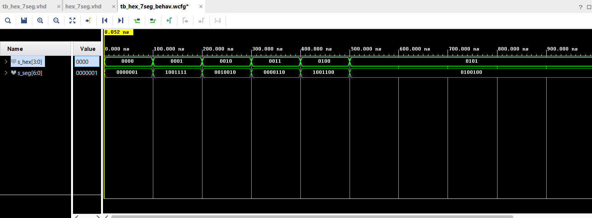

# Preperation Task

| **Segment** | **Pin 1** | **Pin 2** |**Transistor**| 
| :-: | :-: | :-: | :-: | 
| 1 | U13 | T10 | AN7 | 
| 2 | K2 | R10 | AN6 | 
| 3 | T14 | K16 | AN5 | 
| 4 | P14 | K13 | AN4 | 
| 5 | J14 | P15 | AN3 | 
| 6 | T9 | T11 | AN2 | 
| 7 | J18 | L18 | AN1 | 
| 8 | J17 | H15 | AN0 | 


| **Hex** | **Inputs** | **A** |**B**| **C** | **D** | **E** | **F** | **G** |
| :-: | :-: | :-: | :-: | :-: | :-: | :-: | :-: | :-: |
| 0 | 0000 | 0 | 0 | 0 | 0 | 0 | 0 | 1 |
| 1 | 0001 | 1 | 0 | 0 | 1 | 1 | 1 | 1 |
| 2 | 0010 | 0 | 0 | 1 | 0 | 0 | 1 | 0 |
| 3 | 0011 | 0 | 0 | 0 | 0 | 1 | 0 | 0 |
| 4 | 0100 | 1 | 0 | 0 | 1 | 1 | 0 | 0 |
| 5 | 0101 | 0 | 1 | 0 | 0 | 1 | 0 | 0 |
| 6 | 0110 | 0 | 1 | 0 | 0 | 0 | 0 | 0 |
| 7 | 0111 | 0 | 0 | 0 | 1 | 1 | 1 | 1 |
| 8 | 1000 | 0 | 0 | 0 | 0 | 0 | 0 | 0 |
| 9 | 1001 | 0 | 0 | 0 | 0 | 1 | 0 | 0 |
| A | 1010 | 0 | 0 | 0 | 0 | 0 | 1 | 0 | 
| b | 1011 | 1 | 1 | 0 | 0 | 0 | 0 | 0 | 
| C | 1100 | 1 | 1 | 1 | 0 | 0 | 1 | 0 |
| d | 1101 | 1 | 0 | 0 | 0 | 0 | 1 | 0 |
| E | 1110 | 0 | 1 | 1 | 0 | 0 | 0 | 0 |
| F | 1111 | 0 | 1 | 1 | 1 | 0 | 0 | 0 |


# Part 2

## VHDL architecture from source file 

````vhdl

architecture Behavioral of hex_7seg is

begin

    --------------------------------------------------------------------
    -- p_7seg_decoder:
    -- A combinational process for 7-segment display decoder. 
    -- Any time "hex_i" is changed, the process is "executed".
    -- Output pin seg_o(6) corresponds to segment A, seg_o(5) to B, etc.
    --------------------------------------------------------------------
    p_7seg_decoder : process(hex_i)
    begin
        case hex_i is
            when "0000" =>
                seg_o <= "0000001";     -- 0
                
            when "0001" =>
                seg_o <= "1001111";     -- 1
    
            when "0010" =>
                seg_o <= "0010010";     -- 2
                
            when "0011" =>
                seg_o <= "0000110";     -- 3
                
            when "0100" =>
                seg_o <= "1001100";     -- 4
            
            when "0101" =>
                seg_o <= "0100100";     -- 5
                
            when "0110" =>
                seg_o <= "0100000";     -- 6
            
            when "0111" =>
                seg_o <= "0001111";     -- 7
                
            when "1000" =>
                seg_o <= "0000000";     -- 8
                
            when "1001" =>
                seg_o <= "0000100";     -- 9
                
            -- WRITE YOUR CODE HERE
            when "1010" =>
                seg_o <= "0001000";     -- A
                
            when "1011" =>
                seg_o <= "1100000";     -- b
            
            when "1100" =>
                seg_o <= "1110010";     -- C
                
            when "1101" =>
                seg_o <= "1000010";     -- d
            
            when "1110" =>
                seg_o <= "0110000";     -- E
                
            when others =>
                seg_o <= "0111000";     -- F
        end case;
    end process p_7seg_decoder;

end Behavioral;
````

## VHDL stimulus process from testbench file

````vhdl

p_stimulus : process
    begin
        -- Report a note at the begining of stimulus process
        report "Stimulus process started" severity note;
        
        
         s_hex <= "0000"; wait for 100ns;
         
         s_hex <= "0001"; wait for 100ns;
         
         s_hex <= "0010"; wait for 100ns;
         
         s_hex <= "0011"; wait for 100ns;
         
         s_hex <= "0100"; wait for 100ns;
          
         s_hex <= "0101"; wait for 100ns;
         
        
        
        -- Report a note at the end of stimulus process
        report "Stimulus process finished" severity note;
        wait;
    end process p_stimulus;
````

## Simulation



## Source file

```` vhdl

library IEEE;
use IEEE.STD_LOGIC_1164.ALL;

-- Uncomment the following library declaration if using
-- arithmetic functions with Signed or Unsigned values
--use IEEE.NUMERIC_STD.ALL;

-- Uncomment the following library declaration if instantiating
-- any Xilinx leaf cells in this code.
--library UNISIM;
--use UNISIM.VComponents.all;

entity top1 is
    Port ( SW : in std_logic_vector (4 - 1 downto 0);
           CA : out STD_LOGIC;
           CB : out STD_LOGIC;
           CC : out STD_LOGIC;
           CD : out STD_LOGIC;
           CE : out std_logic;
           CF : out STD_LOGIC;
           CG : out STD_LOGIC;
           
           LED : out std_logic_vector(8 - 1 downto 0);
           AN  : out std_logic_vector(8 - 1 downto 0)
           );
end top1;

architecture Behavioral of top1 is

begin

 -- Instance (copy) of hex_7seg entity
    hex2seg : entity work.hex_7seg
        port map(
            hex_i    => SW,
            seg_o(6) => CA,
            seg_o(5) => CB,
            seg_o(4) => CC,
            seg_o(3) => CD,
            seg_o(2) => CE,
            seg_o(1) => CF,
            seg_o(0) => CG

            -- WRITE YOUR CODE HERE
        );

    -- Connect one common anode to 3.3V
    AN <= b"1111_0111";

    -- Display input value
    LED(3 downto 0) <= SW;

    -- Turn LED(4) on if input value is equal to 0, ie "0000"
    -- WRITE YOUR CODE HERE
    
    -- Turn LED(5) on if input value is greater than 9
    -- WRITE YOUR CODE HERE
    
    -- Turn LED(6) on if input value is odd, ie 1, 3, 5, ...
    -- WRITE YOUR CODE HERE
    
    -- Turn LED(7) on if input value is a power of two, ie 1, 2, 4, or 8
    -- WRITE YOUR CODE HERE

end Behavioral;
````
