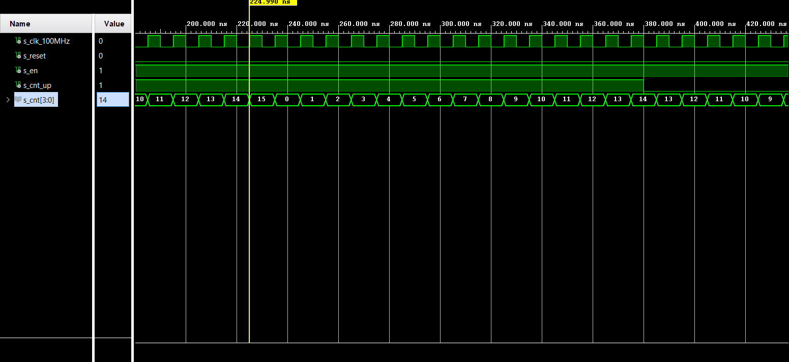
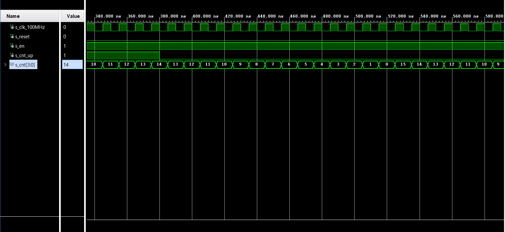

# Preparation task

##  Connection of push buttons

| **Button** | **Pin** |
| :-: | :-: |
| BTNL | P17 |
| BTNR | M17 |
| BTNU | M18  |
| BRND | P18 |
| BTNC | N17 |


## Calculated values 

| **Time interval** | **Number of clk periods** | **Number of clk periods in hex** |**Number of clk periods in binary**| 
| :-: | :-: | :-: | :-: | 
| 2ms | 200 000 | x"3_0d40" | b"0011_0000_1101_0100_0000" | 
| 4ms | 400 000 | x"6_1a80" | b"0110_0001_1010_1000_0000" | 
| 10ms | 1 000 000  | x"f_4240" | b"1111_0100_0010_0100_0000" | 
| 250ms | 25 000 000 | x"26_25A0" | b"0010_0110_0010_0101_1010_0000" | 
| 500ms | 50 000 000 | x"4C_4B40" | b"0100_1100_0100_1011_0100_0000" | 
| 1 sec | 100 000 000 | x"5F5_E100" | b"0101_1111_0101_1110_0001_0000_0000" | 

# Task 2

## code of the process p_cnt_up_down

```vhdl
------------------------------------------------------------------------
--
-- N-bit Up/Down binary counter.
-- Nexys A7-50T, Vivado v2020.1.1, EDA Playground
--
-- Copyright (c) 2019-Present Tomas Fryza
-- Dept. of Radio Electronics, Brno University of Technology, Czechia
-- This work is licensed under the terms of the MIT license.
--
------------------------------------------------------------------------

library ieee;
use ieee.std_logic_1164.all;
use ieee.numeric_std.all;

------------------------------------------------------------------------
-- Entity declaration for n-bit counter
------------------------------------------------------------------------
entity cnt_up_down is
    generic(
        g_CNT_WIDTH : natural := 4      -- Number of bits for counter
    );
    port(
        clk      : in  std_logic;       -- Main clock
        reset    : in  std_logic;       -- Synchronous reset
        en_i     : in  std_logic;       -- Enable input
        cnt_up_i : in  std_logic;       -- Direction of the counter
        cnt_o    : out std_logic_vector(g_CNT_WIDTH - 1 downto 0)
    );
end entity cnt_up_down;

------------------------------------------------------------------------
-- Architecture body for n-bit counter
------------------------------------------------------------------------
architecture behavioral of cnt_up_down is

    -- Local counter
    signal s_cnt_local : unsigned(g_CNT_WIDTH - 1 downto 0);

begin
    --------------------------------------------------------------------
    -- p_cnt_up_down:
    -- Clocked process with synchronous reset which implements n-bit 
    -- up/down counter.
    --------------------------------------------------------------------
    p_cnt_up_down : process(clk)
    begin
        if rising_edge(clk) then
        
            if (reset = '1') then               -- Synchronous reset
                s_cnt_local <= (others => '0'); -- Clear all bits

            elsif (en_i = '1') then       -- Test if counter is enabled


                -- TEST COUNTER DIRECTION HERE
                if (cnt_up_i = '1') then
                    s_cnt_local <= s_cnt_local + 1;
                   
                else
                
                    s_cnt_local <= s_cnt_local -1;
                end if;

            end if;
        end if;
    end process p_cnt_up_down;

    -- Output must be retyped from "unsigned" to "std_logic_vector"
    cnt_o <= std_logic_vector(s_cnt_local);

end architecture behavioral;
```

## reset and stimulus processes from testbench file

```vhdl
p_reset_gen : process
    begin
        s_reset <= '0';
        wait for 12 ns;
        
        -- Reset activated
        s_reset <= '1';
        wait for 73 ns;

        s_reset <= '0';
        wait;
    end process p_reset_gen;

    --------------------------------------------------------------------
    -- Data generation process
    --------------------------------------------------------------------
    p_stimulus : process
    begin
        report "Stimulus process started" severity note;

        -- Enable counting
        s_en     <= '1';
        
        -- Change counter direction
        s_cnt_up <= '1';
        wait for 380 ns;
        s_cnt_up <= '0';
        wait for 220 ns;

        -- Disable counting
        s_en     <= '0';

        report "Stimulus process finished" severity note;
        wait;
    end process p_stimulus;
```

## Screenshots





# Task 3

## code from source file top.vhd

```vhdl
----------------------------------------------------------------------------------
-- Company: 
-- Engineer: 
-- 
-- Create Date: 10.03.2021 11:30:24
-- Design Name: 
-- Module Name: top - Behavioral
-- Project Name: 
-- Target Devices: 
-- Tool Versions: 
-- Description: 
-- 
-- Dependencies: 
-- 
-- Revision:
-- Revision 0.01 - File Created
-- Additional Comments:
-- 
----------------------------------------------------------------------------------


library IEEE;
use IEEE.STD_LOGIC_1164.ALL;

-- Uncomment the following library declaration if using
-- arithmetic functions with Signed or Unsigned values
--use IEEE.NUMERIC_STD.ALL;

-- Uncomment the following library declaration if instantiating
-- any Xilinx leaf cells in this code.
--library UNISIM;
--use UNISIM.VComponents.all;

entity top is
    Port ( CLK100MHZ : in STD_LOGIC;
           BTNC      : in STD_LOGIC;
           SW        : in STD_LOGIC_VECTOR (0 downto 0);
           LED       : out STD_LOGIC_VECTOR (3 downto 0);
           CA        : out STD_LOGIC;
           CB        : out STD_LOGIC;
           CC        : out STD_LOGIC;
           CD        : out STD_LOGIC;
           CE        : out STD_LOGIC;
           CF        : out STD_LOGIC;
           CG        : out STD_LOGIC;
           AN        : out STD_LOGIC_VECTOR (7 downto 0));
end top;
------------------------------------------------------------------------
-- Architecture body for top level
------------------------------------------------------------------------
architecture Behavioral of top is

    -- Internal clock enable
    signal s_en  : std_logic;
    -- Internal counter
    signal s_cnt : std_logic_vector(4 - 1 downto 0);

begin

    --------------------------------------------------------------------
    -- Instance (copy) of clock_enable entity
    clk_en0 : entity work.clock_enable
        generic map(
            g_MAX => 100000000
        )
        port map(
            clk => CLK100MHZ,
            reset => BTNC,
            ce_o => s_en
        );

    --------------------------------------------------------------------
    -- Instance (copy) of cnt_up_down entity
    bin_cnt0 : entity work.cnt_up_down
        generic map(
            g_CNT_WIDTH => 4
        )
        port map(
            clk         => CLK100MHZ,
            reset       => BTNC,
            en_i        => s_en,
            cnt_up_i    => SW(0),
            cnt_o       => s_cnt
        );

    -- Display input value on LEDs
    LED(3 downto 0) <= s_cnt;

    --------------------------------------------------------------------
    -- Instance (copy) of hex_7seg entity
    hex2seg : entity work.hex_7seg
        port map(
            hex_i    => s_cnt,
            seg_o(6) => CA,
            seg_o(5) => CB,
            seg_o(4) => CC,
            seg_o(3) => CD,
            seg_o(2) => CE,
            seg_o(1) => CF,
            seg_o(0) => CG
        );

    -- Connect one common anode to 3.3V
    AN <= b"1111_1110";

end architecture Behavioral;
```

