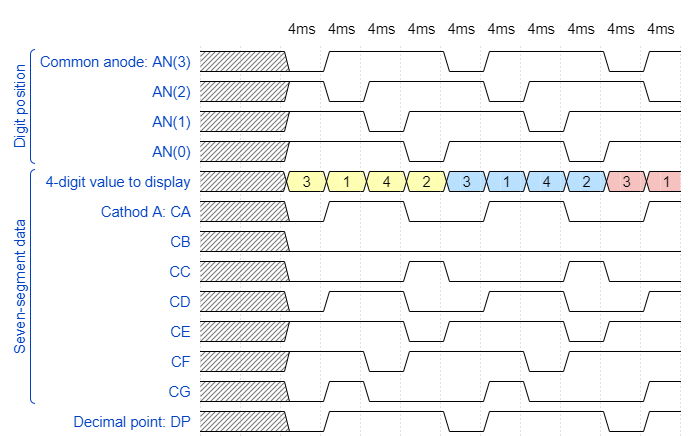

# 1. Preperation Task



# Display driver

## process p_mux

```vhdl
p_mux : process(s_cnt, data0_i, data1_i, data2_i, data3_i, dp_i)
    begin
        case s_cnt is
            when "11" =>
                s_hex <= data3_i;
                dp_o  <= dp_i(3);
                dig_o <= "0111";

            when "10" =>
                -- WRITE YOUR CODE HERE
                s_hex <= data2_i;
                dp_o  <= dp_i(2);
                dig_o <= "1011";

            when "01" =>
                -- WRITE YOUR CODE HERE
                s_hex <= data1_i;
                dp_o  <= dp_i(1);
                dig_o <= "1101";

            when others =>
                -- WRITE YOUR CODE HERE
                s_hex <= data0_i;
                dp_o  <= dp_i(0);
                dig_o <= "1110";
        end case;
    end process p_mux;
```

## testbench file tb_driver_7seg_4digits

```vhdl

```

## Screenshot


## architecture of the top layer

```vhdl
architecture Behavioral of top is

begin

    driver_seg_4 : entity work.driver_7seg_4digits
        port map(
            clk         => CLK100MHZ,
            reset       => BTNC,
            data0_i(3)  => SW(3),
            data0_i(2)  => SW(2),
            data0_i(1)  => SW(1),
            data0_i(0)  => SW(0),
        
            data1_i(3)  => SW(7),
            data1_i(2)  => SW(6),
            data1_i(1)  => SW(5),
            data1_i(0)  => SW(4),
        
            data2_i(3)  => SW(11),
            data2_i(2)  => SW(10),
            data2_i(1)   => SW(9),
            data2_i(0)   => SW(8),
        
            data3_i(3)  => SW(15),
            data3_i(2)  => SW(14),
            data3_i(1)  => SW(13),
            data3_i(0)  => SW(12),
        
            dig_o => AN(4-1 downto 0),
            
            seg_o(0) => CA,
            seg_o(1) => CB,
            seg_o(2) => CC,
            seg_o(3) => CD,
            seg_o(4) => CE,
            seg_o(5) => CF,
            seg_o(6) => CG,
            
            dp_i => "0111",
            dp_o => DP
        );
    AN(7 downto 4) <= b"1111";    
end Behavioral;
```