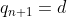
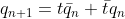
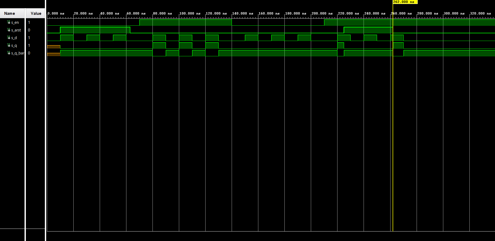

# 1. Preparation Task

## D flip-flop



| **d** | **Qn** | **Q(n+1)** | **Comments** |
| :-: | :-: | :-: | :-: |
| 0 | 0 | 0 |  |
| 0 | 1 | 0 | 1 |
| 1 | 0 | 1 | 0 |
| 1 | 1 | 1 | 1 |

## JK flip-flop


| **j** | **k** | **Qn** | **Q(n+1)** | **Comments** |
| :-: | :-: | :-: | :-: | :-: |
| 0 | 0 | 0 | 0 | No change |
| 0 | 0 | 1 | 1 | No change |
| 0 | 1 | 0 | 0 | Reset |
| 0 | 1 | 1 | 0 | Reset |
| 1 | 0 | 0 | 1 | Set |
| 1 | 0 | 1 | 1 | Set |
| 1 | 1 | 0 | 1 | Toggle |
| 1 | 1 | 1 | 0 | Toggle |

## T flip-flop



| **t** | **Qn** | **Q(n+1)** | **Comments** |
| :-: | :-: | :-: | :-: |
| 0 | 0 | 0 | No change |
| 0 | 1 | 1 | No change |
| 1 | 0 | 1 | Invert (Toggle) |
| 1 | 1 | 0 | Invert (Toggle) |

# 2. D latch

## process p_d_latch:

```vhdl
begin

    p_d_latch : process (d, arst, en)
    begin
        if (arst = '1') then
            q       <= '0';
            q_bar   <= '1';
            
        elsif (en = '1') then
            q       <= d;
            q_bar   <= not d;
            
        end if;
        
    end process p_d_latch;
```

## testbench tb_d_latch.vhd:

```vhdl
p_arst_gen : process
    begin
        s_arst <= '0';
        wait for 10 ns;
        
        -- Reset activated
        s_arst <= '1';
        wait for 53 ns;

        s_arst <= '0';
        wait for 162 ns;
        
        s_arst <= '1';
        wait for 37 ns;
        
        s_arst <= '0';
        wait;
        
        end process p_arst_gen;
    
    
       --------------------------------------------------------------------
    -- Data generation process
    --------------------------------------------------------------------
   p_stimulus: process
    begin
        report "Stimulus process started" severity note;
        s_en <= '0';
        s_d <= '0';
        
        --d sequence
        wait for 10 ns;
        s_d <= '1';
        wait for 10 ns;
        s_d <= '0';
        wait for 10 ns;
        s_d <= '1';
        wait for 10 ns;
        s_d <= '0';
        wait for 10 ns;
        s_d <= '1';
        wait for 10 ns;
        s_d <= '0';
        wait for 10 ns;
        --/d sequence
        
        s_en <= '1';
        
        --d sequence
        wait for 10 ns;
        s_d <= '1';
        
        wait for 5 ns;
        assert(s_q = '1' and s_q_bar = '0')
        report "asdad adad dad" severity error;
        
        wait for 5 ns;
        s_d <= '0';
        wait for 10 ns;
        s_d <= '1';
        wait for 10 ns;
        s_d <= '0';
        wait for 10 ns;
        s_d <= '1';
        wait for 10 ns;
        s_d <= '0';
        wait for 10 ns;
        --/d sequence
        
        s_en <= '0';
        
        --d sequence
        wait for 10 ns;
        s_d <= '1';
        wait for 10 ns;
        s_d <= '0';
        wait for 10 ns;
        s_d <= '1';
        wait for 10 ns;
        s_d <= '0';
        wait for 10 ns;
        s_d <= '1';
        wait for 10 ns;
        s_d <= '0';
        wait for 10 ns;
        --/d sequence
        
        s_en <= '1';
        
        wait for 5 ns;
        assert(s_q = '0' and s_q_bar = '1')
        report "asdad adad dad" severity error;
        
        --d sequence
        wait for 5 ns;
        s_d <= '1';
        wait for 10 ns;
        s_d <= '0';
        wait for 10 ns;
        s_d <= '1';
        wait for 10 ns;
        s_d <= '0';
        wait for 10 ns;
        s_d <= '1';
        wait for 10 ns;
        s_d <= '0';
        wait for 10 ns;
        --/d sequence
        
        report "Stimulus process finished" severity note;
        wait;
        
    end process p_stimulus;
```

## Screenshot:



