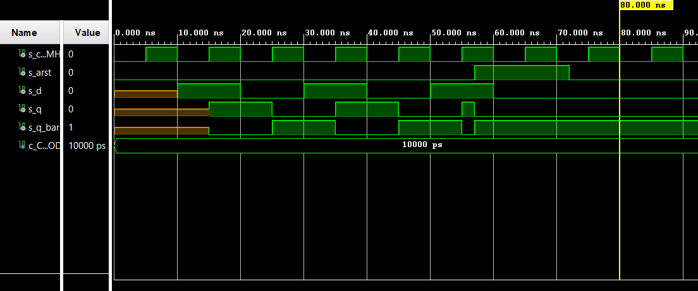

# 1. Preparation Task

## D flip-flop


| **d** | **Qn** | **Q(n+1)** | **Comments** |
| :-: | :-: | :-: | :-: |
| 0 | 0 | 0 | Reset |
| 0 | 1 | 0 | Reset |
| 1 | 0 | 1 | Set |
| 1 | 1 | 1 | Set |

## JK flip-flop


| **j** | **k** | **Qn** | **Q(n+1)** | **Comments** |
| :-: | :-: | :-: | :-: | :-: |
| 0 | 0 | 0 | 0 | No change |
| 0 | 0 | 1 | 1 | No change |
| 0 | 1 | 0 | 0 | Reset |
| 0 | 1 | 1 | 0 | Reset |
| 1 | 0 | 0 | 1 | Set |
| 1 | 0 | 1 | 1 | Set |
| 1 | 1 | 0 | 1 | Toggle |
| 1 | 1 | 1 | 0 | Toggle |

## T flip-flop


| **t** | **Qn** | **Q(n+1)** | **Comments** |
| :-: | :-: | :-: | :-: |
| 0 | 0 | 0 | No change |
| 0 | 1 | 1 | No change |
| 1 | 0 | 1 | Invert (Toggle) |
| 1 | 1 | 0 | Invert (Toggle) |

# 2. D latch

## process p_d_latch:

```vhdl
begin

    p_d_latch : process (d, arst, en)
    begin
        if (arst = '1') then
            q       <= '0';
            q_bar   <= '1';
            
        elsif (en = '1') then
            q       <= d;
            q_bar   <= not d;
            
        end if;
        
    end process p_d_latch;
```

## testbench tb_d_latch.vhd:

```vhdl
p_arst_gen : process
    begin
        s_arst <= '0';
        wait for 10 ns;
        
        -- Reset activated
        s_arst <= '1';
        wait for 53 ns;

        s_arst <= '0';
        wait for 162 ns;
        
        s_arst <= '1';
        wait for 37 ns;
        
        s_arst <= '0';
        wait;
        
        end process p_arst_gen;
    
    
       --------------------------------------------------------------------
    -- Data generation process
    --------------------------------------------------------------------
   p_stimulus: process
    begin
        report "Stimulus process started" severity note;
        s_en <= '0';
        s_d <= '0';
        
        --d sequence
        wait for 10 ns;
        s_d <= '1';
        wait for 10 ns;
        s_d <= '0';
        wait for 10 ns;
        s_d <= '1';
        wait for 10 ns;
        s_d <= '0';
        wait for 10 ns;
        s_d <= '1';
        wait for 10 ns;
        s_d <= '0';
        wait for 10 ns;
        --/d sequence
        
        s_en <= '1';
        
        --d sequence
        wait for 10 ns;
        s_d <= '1';
        
        wait for 5 ns;
        assert(s_q = '1' and s_q_bar = '0')
        report "asdad adad dad" severity error;
        
        wait for 5 ns;
        s_d <= '0';
        wait for 10 ns;
        s_d <= '1';
        wait for 10 ns;
        s_d <= '0';
        wait for 10 ns;
        s_d <= '1';
        wait for 10 ns;
        s_d <= '0';
        wait for 10 ns;
        --/d sequence
        
        s_en <= '0';
        
        --d sequence
        wait for 10 ns;
        s_d <= '1';
        wait for 10 ns;
        s_d <= '0';
        wait for 10 ns;
        s_d <= '1';
        wait for 10 ns;
        s_d <= '0';
        wait for 10 ns;
        s_d <= '1';
        wait for 10 ns;
        s_d <= '0';
        wait for 10 ns;
        --/d sequence
        
        s_en <= '1';
        
        wait for 5 ns;
        assert(s_q = '0' and s_q_bar = '1')
        report "asdad adad dad" severity error;
        
        --d sequence
        wait for 5 ns;
        s_d <= '1';
        wait for 10 ns;
        s_d <= '0';
        wait for 10 ns;
        s_d <= '1';
        wait for 10 ns;
        s_d <= '0';
        wait for 10 ns;
        s_d <= '1';
        wait for 10 ns;
        s_d <= '0';
        wait for 10 ns;
        --/d sequence
        
        report "Stimulus process finished" severity note;
        wait;
        
    end process p_stimulus;
```

## Screenshot:


# 3. Flip-flops

## VHDL processes:

### p_d_ff_arst:

```vhdl
begin
    p_d_ff_arst : process (clk, arst)
        begin
            if (arst = '1') then
                q       <= '0';
                q_bar   <= '1';
                
            elsif (rising_edge(clk)) then
                q       <= d;
                q_bar   <= not d;
                
            end if;
            
        end process  p_d_ff_arst;
```

### p_d_ff_rst:

```vhdl
begin
    p_d_ff_rst : process (clk, rst)
        begin
            if (rst = '1' and rising_edge(clk)) then
                q       <= '0';
                q_bar   <= '1';
                
            elsif (rising_edge(clk)) then
                q       <= d;
                q_bar   <= not d;
                
            end if;
            
        end process  p_d_ff_rst;
```

### p_jk_ff_rst:

```vhdl
begin
 p_jk_ff_rst : process (clk)
    begin
            
        if rising_edge(clk) then
            if (rst = '1') then
                s_q <= '0';
            else
                if (j = '0' and k = '0') then
                    s_q <= s_q;
                    
                elsif (j = '0' and k = '1') then
                    s_q <= '0';
                    
                elsif (j = '1' and k = '0') then
                s_q <= '1';
                
                elsif (j = '1' and k = '1') then 
                    s_q <= not s_q;
                
                end if;
            end if;
        end if;
        
    end process  p_jk_ff_rst;
```

### p_t_ff_rst:

```vhdl
begin
            
        if rising_edge(clk) then
            if (rst = '1') then
                s_q <= '0';
            else
                if (t = '0') then
                    s_q <= s_q;
                    
                elsif (t = '1') then
                    s_q <= not s_q;
                
                end if;
            end if;
        end if;
        
    end process  p_t_ff_rst;
```

## VHDL clock, reset and stimulus processes from the testbench files:

### tb_d_ff_arst:

```vhdl
    p_clk_gen : process
        begin
            while now < 750 ns loop         -- 75 periods of 100MHz clock
                s_clk_100MHz <= '0';
                wait for c_CLK_100MHZ_PERIOD / 2;
                s_clk_100MHz <= '1';
                wait for c_CLK_100MHZ_PERIOD / 2;
            end loop;
            wait;
        end process p_clk_gen;
    
    
    p_arst_gen : process
        begin
            s_arst <= '0';
            wait for 57 ns;
            
            -- Reset activated
            s_arst <= '1';
            wait for 15 ns;
    
            s_arst <= '0';
            wait;
        end process p_arst_gen;
    
    
    p_stimulus : process
        begin
            report "Stimulus process started" severity note;
            --d sequence
            wait for 10 ns;
            s_d <= '1';
            
            wait for 7 ns;
            assert(s_q = '1' and s_q_bar = '0')
            report "asdad adad dad" severity error;
        
            wait for 3 ns;
            s_d <= '0';
            wait for 10 ns;
            s_d <= '1';
            wait for 10 ns;
            s_d <= '0';
            wait for 10 ns;
            s_d <= '1';
            
            wait for 9 ns;
            assert(s_q = '0' and s_q_bar = '1')
            report "asdad adad dad" severity error;
        
            wait for 1 ns;
            s_d <= '0';
            --/d sequence
            
            report "Stimulus process finished" severity note;
            wait;
        end process p_stimulus;
```

### tb_d_ff_rst:

```vhdl
p_clk_gen : process
        begin
            while now < 750 ns loop         -- 75 periods of 100MHz clock
                s_clk_100MHz <= '0';
                wait for c_CLK_100MHZ_PERIOD / 2;
                s_clk_100MHz <= '1';
                wait for c_CLK_100MHZ_PERIOD / 2;
            end loop;
            wait;
        end process p_clk_gen;
        
        
    p_rst_gen : process
        begin
            s_rst <= '0';
            wait for 57 ns;
            
            -- Reset activated
            s_rst <= '1';
            wait for 19 ns;
    
            s_rst <= '0';
            wait;
        end process p_rst_gen;    
     
     p_stimulus : process
        begin
            report "Stimulus process started" severity note;
            --d sequence
            wait for 10 ns;
            s_d <= '1';
            
            wait for 8 ns;
            assert(s_q = '1' and s_q_bar = '0')
            report "asdad adad dad" severity error;
            
            wait for 2 ns;
            s_d <= '0';
            wait for 10 ns;
            s_d <= '1';
            wait for 10 ns;
            s_d <= '0';
            wait for 10 ns;
            s_d <= '1';
            wait for 10 ns;
            s_d <= '0';
            wait for 10 ns;
            s_d <= '1';
            
            wait for 3 ns;
            assert(s_q = '0' and s_q_bar = '1')
            report "asdad adad dad" severity error;
            
            wait for 7 ns;
            s_d <= '0';           
            --/d sequence
            
            report "Stimulus process finished" severity note;
            wait;
        end process p_stimulus;
```

### tb_jk_ff_rst:

```vhdl

p_clk_gen : process
        begin
            while now < 750 ns loop         -- 75 periods of 100MHz clock
                s_clk_100MHz <= '0';
                wait for c_CLK_100MHZ_PERIOD / 2;
                s_clk_100MHz <= '1';
                wait for c_CLK_100MHZ_PERIOD / 2;
            end loop;
            wait;
        end process p_clk_gen;


    p_rst_gen : process
        begin
            s_rst <= '0';
            wait for 46 ns;
            
            -- Reset activated
            s_rst <= '1';
            wait for 13 ns;
    
            s_rst <= '0';
            wait;
        end process p_rst_gen;
    
    
    p_stimulus : process
    begin
        report "Stimulus process started" severity note;
        --d sequence
        wait for 10 ns;
        s_j <= '0';
        s_k <= '0';
        
        wait for 20 ns;
        s_j <= '0';
        s_k <= '1';
        
        wait for 10 ns;
        assert(s_q = '0' and s_q_bar = '1')
        report "asdad adad dad" severity error;
        
        wait for 10 ns;
        s_j <= '1';
        s_k <= '0';
        
        wait for 17 ns;
        assert(s_q = '1' and s_q_bar = '0')
        report "asdad adad dad" severity error;
        
        wait for 3 ns;
        s_j <= '1';
        s_k <= '1';
        
        wait for 20 ns;
        s_j <= '0';
        s_k <= '0';
        
        wait for 20 ns;
        s_j <= '0';
        s_k <= '1';
        
        wait for 20 ns;
        s_j <= '1';
        s_k <= '0';
        
        wait for 20 ns;
        s_j <= '1';
        s_k <= '1';
        
        --/d sequence
        
        report "Stimulus process finished" severity note;
        wait;
    end process p_stimulus;
```

### tb_t_ff_rst:

```vhdl
p_clk_gen : process
         p_clk_gen : process
        begin
            while now < 750 ns loop         -- 75 periods of 100MHz clock
                s_clk_100MHz <= '0';
                wait for c_CLK_100MHZ_PERIOD / 2;
                s_clk_100MHz <= '1';
                wait for c_CLK_100MHZ_PERIOD / 2;
            end loop;
            wait;
        end process p_clk_gen;


    p_rst_gen : process
        begin
            s_rst <= '0';
            wait for 10 ns;
            
            -- Reset activated
            s_rst <= '1';
            wait for 13 ns;
    
            s_rst <= '0';
            wait;
        end process p_rst_gen;
    
    
    p_stimulus : process
    begin
        report "Stimulus process started" severity note;
        --d sequence
        wait for 20 ns;
        s_t <= '0';
        
        wait for 10 ns;
        assert(s_q = '0' and s_q_bar = '1')
        report "asdad adad dad" severity error;
        
        wait for 10 ns;
        s_t <= '1';
        
        wait for 10 ns;
        assert(s_q = '1' and s_q_bar = '0')
        report "asdad adad dad" severity error;
        
        wait for 10 ns;
        s_t <= '0';
        
        wait for 20 ns;
        s_t <= '1';
        
        wait for 20 ns;
        s_t <= '0';
        
        wait for 20 ns;
        s_t <= '1';
        
        --/d sequence
        
        report "Stimulus process finished" severity note;
        wait;
    end process p_stimulus;
```
## Screenshots:

### d_ff_arst



### d_ff_rst:


### jk_ff_rst:


### t_ff_rst:


# 4. Shift register:


