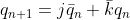

# 1. Preparation Task

## D flip-flop

| **d** | **Qn** | **Q(n+1)** | **Comments** |
| :-: | :-: | :-: | :-: |
| 0 | 0 | 0 |  |
| 0 | 1 | 0 | 1 |
| 1 | 0 | 1 | 0 |
| 1 | 1 | 1 | 1 |

## JK flip-flop

| **j** | **k** | **Qn** | **Q(n+1)** | **Comments** |
| :-: | :-: | :-: | :-: | :-: |
| 0 | 0 | 0 | 0 | No change |
| 0 | 0 | 1 | 1 | No change |
| 0 | 1 | 0 | 0 | Reset |
| 0 | 1 | 1 | 0 | Reset |
| 1 | 0 | 0 | 1 | Set |
| 1 | 0 | 1 | 1 | Set |
| 1 | 1 | 0 | 1 | Toggle |
| 1 | 1 | 1 | 0 | Toggle |

## T flip-flop

| **t** | **Qn** | **Q(n+1)** | **Comments** |
| :-: | :-: | :-: | :-: |
| 0 | 0 | 0 | No change |
| 0 | 1 | 1 | No change |
| 1 | 0 | 1 | Invert (Toggle) |
| 1 | 1 | 0 | Invert (Toggle) |

